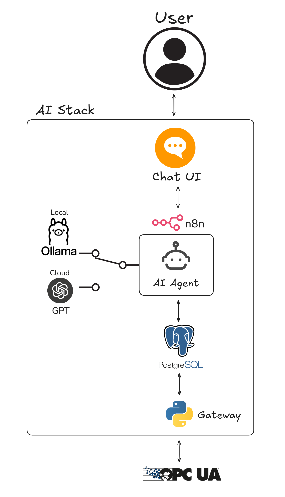

# OPC-UA-LLM-stack

**OPC-UA-LLM-stack** connects industrial OPC UA servers with PostgreSQL databases, enabling bidirectional synchronization, change detection (AI/External), and workflow automation via n8n

<table>
<tr>
<td width="50%" valign="top">

## Table of Contents
- [Features](#features)
- [Getting Started](#getting-started)
- [Usage](#usage)
- [Development](#development)
- [Troubleshooting](#troubleshooting)
- [Contributing](#contributing)
- [License](#license)
</td>
<td width="50%">
	
</td>
</tr></table>

# Features

- **Gateway:**
	- **OPC UA ↔ PostgreSQL Sync**: Bidirectional data synchronization between industrial OPC UA servers and PostgreSQL databases
	- **Change Detection**: AI/external logic for detecting and propagating changes
- **Workflow Automation**: Integrated with n8n for orchestrating data flows and external API connections
- **Configurable**: External YAML configuration for flexible deployments
- **Dockerized**: Easy setup and deployment with Docker Compose
- **Local Chat**: Interact with the AI agent through a local chat UI
- **AI Agent**: Interact with Loki AI agent through a local Ollama model or cloud-based OpenAI ChatGPT model (configurable).

### Missing essentials

- **LLM History**: The AI agent has no memory; conversations are independent, and it cannot remember previous interactions
- **Python Tests**: There are currently no integrated tests for the Python program
- **OPC Discovery Client**: Node discovery is not yet implemented; you must manually input OPC UA node IDs

# Getting Started

## Environment Variables

Before starting, copy `.env.example` to `.env` and fill in your environment variables. This file configures database, OPC UA and n8n services

## Configuration

Edit `config/config.yaml` to set up your OPC UA, Postgres, and n8n connection details before running the gateway

## How to Run

There are three ways to run the gateway:

1. **Docker Compose (Full Stack: Gateway + AI features)**
	 - Runs the gateway and enables local AI features
		 ```bash
		 docker compose up -d
		 ```

2. **Manual Docker Build & Run (Gateway only)**
	 - Only runs the gateway functionality
		 ```bash
		 docker build -t opcua-postgres-gateway:latest .
		 docker run -d --name opcua_pg_gateway -p 5678:5678 opcua-postgres-gateway:latest
		 ```

3. **Native Python (Gateway only)**
	 - Only runs the gateway functionality
		 ```bash
		 pip install -r requirements.txt
		 python src/main.py
		 ```

## Database Initialization

If needed, initialize the sample PostgreSQL database using `init.sql`:
```bash
psql -U <user> -d <database> -f init.sql
```

# Usage

- **n8n UI**: Access workflow automation at `http://localhost:5678`

<p align="center">
  
</p>


- **Loki Chat UI**: Use the local chat UI to interact with Loki AI agent at `http://localhost:8083`. You can configure Loki to use either a local Ollama model or a cloud-based OpenAI ChatGPT model (requires your OpenAI API key).

<p align="center">
  	
</p>

- **Credentials/Workflows**: Place files in `n8n/credentials/` and `n8n/workflows/` for auto-import


# Development

## Architecture

- **Source Code**: All logic in `src/` (OPC UA client, Postgres client, sync engine, change detector)
- **Config**: External YAML files in `config/`
- **n8n**: Automation scripts and credentials in `n8n/`
- **chat-ui**: Web-based chat interface for interacting with the AI agent locally in `chat-ui/`

## Key Files

- `src/main.py`: Entry point, service orchestration
- `src/opcua_client.py`: OPC UA connectivity
- `src/postgres_client.py`: PostgreSQL interface
- `src/sync_engine.py`: Data synchronization logic
- `src/change_detector.py`: Change detection (AI/external)
- `config/config.yaml`: Main configuration
- `n8n/init.sh`: n8n startup automation
- `init.sql`: SQL script for initializing the PostgreSQL database schema
- `chat-ui/index.html`: Main web interface for local AI chat


## Virtual PLCs and Industrial Automation with OTee

You can use the [OTee platform](https://www.otee.io/) to quickly spin up virtual PLCs and OPC-UA servers for development, testing and production. It's a great way to deploy  automation code without extra hardware or vendor lock-in

<p align="center">
  	
</p>

# Troubleshooting

- **n8n Not Starting**: Check container logs (`docker logs <container-name>`), verify port 5678 is free
- **OPC UA/DB Connection Issues**: Confirm config values, network access, and credentials
- **Sync Failures**: Review logs in `logs/` and check `config/logging.yaml` settings
- **Docker Issues**: Ensure Docker is running and ports are mapped correctly
- **LLM/AI Chat Issues**: For Ollama, ensure it is running locally and the correct model is configured in n8n. For OpenAI GPT, check your API key and model settings in the environment variables.

# Contributing

1. Fork and create a feature branch:
	```bash
	git checkout -b feature/your-feature
	```
2. Commit changes:
	```bash
	git commit -m "Add your feature"
	```
3. Push and open a Pull Request:
	```bash
	git push origin feature/your-feature
	```

# License

This project is licensed under the MIT License. See the LICENSE file for details.

---

*Questions or issues? Open an issue on GitHub or contact the maintainer*

